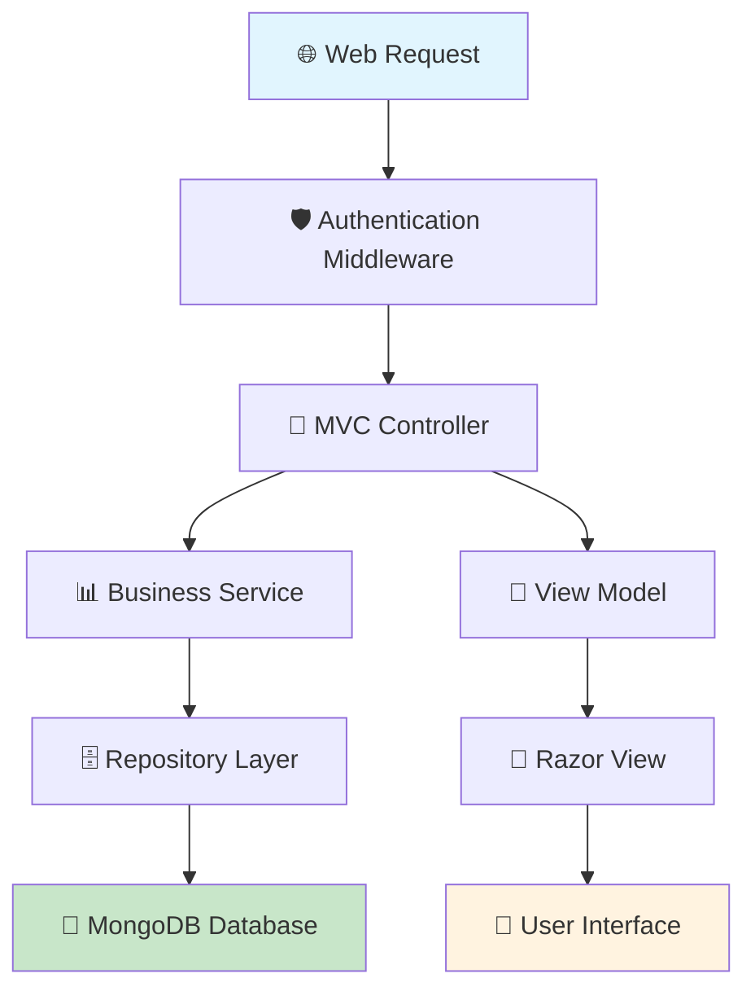

# 🏠 NestShare - Comprehensive Personal Financial Management Platform

<div align="center">

[](https://dotnet.microsoft.com/)
[](https://www.mongodb.com/)
[](https://getbootstrap.com/)
[](LICENSE)
[](https://github.com/yourusername/nestshare)

_A modern, feature-rich financial management application built with ASP.NET Core MVC and MongoDB_

[**🚀 Features**](#-features) • [**📥 Installation**](#-installation) • [**🏗️ Architecture**](#%EF%B8%8F-architecture) • [**📚 Documentation**](#-documentation) • [**🤝 Contributing**](#-contributing)

</div>

---

## 🎯 Overview

**NestShare** is a comprehensive personal financial management platform designed to help individuals and groups manage their finances effectively. Built with modern web technologies and following best practices, it provides a robust solution for budgeting, savings tracking, loan management, and collaborative financial planning through thrift groups.

### 🌟 Key Highlights

- **🏦 Complete Financial Ecosystem**: Manage budgets, savings, loans, and group finances in one place
- **👥 Collaborative Finance**: Thrift group functionality for community savings
- **📊 Smart Analytics**: Advanced financial reporting and visualization
- **🔒 Enterprise Security**: ASP.NET Core Identity with role-based access control
- **📱 Responsive Design**: Modern, mobile-first UI with Bootstrap 5
- **⚡ High Performance**: MongoDB for scalable data management
- **🔧 Extensible Architecture**: Clean, maintainable codebase following MVC patterns

---

## 🚀 Features

### 💰 Core Financial Management

<details>
<summary><strong>🎯 Dashboard & Overview</strong></summary>

- **Financial Summary**: Real-time overview of all financial metrics
- **Recent Transactions**: Quick access to latest financial activities
- **Goal Progress**: Visual tracking of savings and budget targets
- **Quick Actions**: Fast access to common operations
- **Customizable Widgets**: Personalized dashboard experience
</details>

<details>
<summary><strong>💳 Budget Management</strong></summary>

- **Smart Budget Creation**: AI-powered budget recommendations
- **Category-based Budgeting**: Organize expenses by custom categories
  - Housing & Utilities
  - Food & Dining
  - Transportation
  - Healthcare
  - Entertainment
  - Personal Care
  - Debt Payments
- **Budget Tracking**: Real-time expense tracking against budgets
- **Variance Analysis**: Compare actual vs. planned spending
- **Monthly/Annual Views**: Flexible time period management
- **Budget Templates**: Reusable budget structures
</details>

<details>
<summary><strong>🎯 Savings Goals & Management</strong></summary>

- **Goal Setting**: Create SMART savings goals with target amounts and dates
- **Progress Tracking**: Visual progress indicators and milestone celebrations
- **Automated Contributions**: Set up recurring savings transfers
- **Goal Categories**: Organize goals by purpose (Emergency Fund, Vacation, etc.)
- **Achievement Analytics**: Track completion rates and time-to-goal metrics
- **Savings Strategies**: Built-in calculators for different saving approaches
</details>

<details>
<summary><strong>🏦 Loan Management System</strong></summary>

- **Loan Portfolio**: Comprehensive loan tracking and management
- **Payment Scheduling**: Automated payment reminders and tracking
- **Amortization Calculations**: Detailed payment breakdowns
- **Interest Analysis**: Track interest paid over time
- **Early Payment Planning**: Calculate benefits of extra payments
- **Multiple Loan Types**: Support for mortgages, personal loans, auto loans
- **Payment History**: Complete audit trail of all payments
</details>

<details>
<summary><strong>👥 Thrift Groups (Collaborative Finance)</strong></summary>

- **Group Creation**: Start or join savings groups
- **Member Management**: Invite and manage group participants
- **Contribution Tracking**: Monitor member contributions and payouts
- **Rotation Management**: Automated payout scheduling
- **Group Analytics**: Financial health and participation metrics
- **Communication Tools**: In-app messaging and notifications
- **Transparency**: Full visibility into group financial activities
</details>

### 🔐 Security & User Management

<details>
<summary><strong>👤 User Authentication & Authorization</strong></summary>

- **Secure Registration**: Email verification and strong password policies
- **Multi-factor Authentication**: Enhanced security options
- **Role-based Access Control**: Granular permission management
- **Session Management**: Secure session handling with configurable timeouts
- **Password Recovery**: Secure password reset functionality
- **Account Lockout**: Protection against brute force attacks
</details>

<details>
<summary><strong>📊 User Profiles & Settings</strong></summary>

- **Comprehensive Profiles**: Personal and financial information management
- **Notification Preferences**: Customizable alert settings
- **Privacy Controls**: Data sharing and visibility settings
- **Theme Customization**: Personalized user interface
- **Export/Import**: Data portability and backup options
</details>

### 📈 Analytics & Reporting

<details>
<summary><strong>📊 Financial Analytics</strong></summary>

- **Spending Analysis**: Detailed breakdown of expenses by category
- **Income vs. Expense Tracking**: Monthly and yearly comparisons
- **Trend Analysis**: Historical financial pattern recognition
- **Goal Progress Reports**: Savings and budget achievement metrics
- **Cash Flow Statements**: Comprehensive financial flow analysis
- **Custom Reports**: User-defined reporting periods and parameters
</details>

<details>
<summary><strong>📈 Visualization Tools</strong></summary>

- **Interactive Charts**: Dynamic financial data visualization
- **Progress Bars**: Visual goal and budget tracking
- **Trend Lines**: Historical performance indicators
- **Comparison Charts**: Period-over-period analysis
- **Export Capabilities**: PDF and Excel report generation
</details>

---

## 🏗️ Architecture

### 🎨 Technology Stack

<table>
<tr>
<td><strong>🖥️ Backend</strong></td>
<td>


</td>
</tr>
<tr>
<td><strong>🗄️ Database</strong></td>
<td>


</td>
</tr>
<tr>
<td><strong>🎨 Frontend</strong></td>
<td>


</td>
</tr>
<tr>
<td><strong>🔐 Authentication</strong></td>
<td>


</td>
</tr>
<tr>
<td><strong>📧 Services</strong></td>
<td>


</td>
</tr>
</table>

### 🏛️ Project Structure

```
NestShare/
├── 📁 Controllers/           # MVC Controllers for handling HTTP requests
│   ├── 🏠 HomeController.cs          # Landing page and general navigation
│   ├── 📊 DashboardController.cs     # Financial dashboard and overview
│   ├── 💰 BudgetController.cs        # Budget creation and management
│   ├── 🎯 SavingsController.cs       # Savings goals and tracking
│   ├── 🏦 LoanController.cs          # Loan management and calculations
│   ├── 👥 ThriftGroupController.cs   # Group savings functionality
│   ├── 📈 ReportsController.cs       # Financial reporting and analytics
│   ├── ⚙️ SettingsController.cs      # User preferences and configuration
│   └── 🗄️ DatabaseController.cs     # Database management utilities
│
├── 📁 Models/                # Data models and entities
│   ├── 💰 Budget.cs                  # Budget entity and validation
│   ├── 🎯 SavingsGoal.cs            # Savings goals with progress tracking
│   ├── 📝 SavingsEntry.cs           # Individual savings transactions
│   ├── 🏦 Loan.cs                   # Loan information and calculations
│   ├── 💳 LoanPayment.cs            # Payment records and history
│   ├── 👥 ThriftGroup.cs            # Group savings management
│   ├── 👤 User.cs                   # User entity with financial profile
│   ├── 📊 UserProfile.cs            # Extended user information
│   ├── 💸 Expense.cs                # Expense tracking and categorization
│   └── 🏦 AccountBalance.cs         # Account balance management
│
├── 📁 ViewModels/            # Data transfer objects for views
│   ├── 📊 DashboardViewModel.cs      # Dashboard data aggregation
│   ├── 💰 BudgetViewModel.cs         # Budget display and input models
│   ├── 🎯 SavingsViewModel.cs        # Savings goal presentation
│   ├── 🏦 LoanViewModel.cs           # Loan management interface
│   ├── 👥 ThriftGroupViewModel.cs    # Group management views
│   └── 📈 ReportViewModel.cs         # Analytics and reporting data
│
├── 📁 Views/                 # Razor views and UI templates
│   ├── 🏠 Home/                      # Landing pages and static content
│   ├── 📊 Dashboard/                 # Financial overview interfaces
│   ├── 💰 Budget/                    # Budget management UI
│   ├── 🎯 Savings/                   # Savings goal interfaces
│   ├── 🏦 Loan/                      # Loan management views
│   ├── 👥 ThriftGroup/               # Group collaboration UI
│   ├── 📈 Reports/                   # Analytics and reporting views
│   ├── ⚙️ Settings/                  # Configuration interfaces
│   └── 🔧 Shared/                    # Common layouts and partials
│
├── 📁 Data/                  # Database context and configuration
│   ├── 🗄️ MongoDbContext.cs          # MongoDB connection and setup
│   ├── 🔧 ApplicationDbContext.cs    # Entity Framework context
│   └── ⚙️ Configurations/            # Entity configurations
│       └── 🔐 IdentityConfiguration.cs
│
├── 📁 Repositories/          # Data access layer
│   ├── 💰 BudgetRepository.cs        # Budget data operations
│   ├── 🎯 SavingsGoalRepository.cs   # Savings goal data access
│   ├── 📝 SavingsTransactionRepository.cs # Transaction management
│   ├── 🏦 LoanRepository.cs          # Loan data operations
│   ├── 💳 LoanPaymentRepository.cs   # Payment data access
│   ├── 👥 ThriftGroupRepository.cs   # Group data management
│   ├── 👤 UserRepository.cs          # User data operations
│   ├── 💸 ExpenseRepository.cs       # Expense data access
│   └── 🏦 AccountBalanceRepository.cs # Balance management
│
├── 📁 Services/              # Business logic and external services
│   ├── 🔧 LoanCalculationService.cs  # Loan calculations and amortization
│   ├── 📧 EmailSender.cs             # Email notification service
│   └── 🏥 MongoDbHealthCheck.cs      # Database health monitoring
│
├── 📁 Identity/              # Custom identity providers
│   ├── 👤 MongoUserStore.cs          # MongoDB user store implementation
│   └── 🔐 MongoRoleStore.cs          # MongoDB role store implementation
│
├── 📁 Areas/                 # ASP.NET Areas for modular organization
│   └── 🔐 Identity/                  # Identity-related pages and functionality
│       └── 📄 Pages/                 # Razor pages for authentication
│
├── 📁 wwwroot/               # Static web assets
│   ├── 🎨 css/                       # Stylesheets and themes
│   ├── 📜 js/                        # JavaScript files and libraries
│   ├── 🖼️ images/                    # Application images and icons
│   └── 📚 lib/                       # Third-party libraries
│
├── 📁 Migrations/            # Database migrations
│   └── 🔧 Entity Framework migration files
│
├── 📁 Properties/            # Application properties
│   └── ⚙️ launchSettings.json        # Development server configuration
│
├── ⚙️ Program.cs             # Application entry point and DI configuration
├── 🚀 Startup.cs             # Application startup configuration
├── 📄 appsettings.json       # Application configuration
├── 🏗️ Thrift.csproj          # Project file with dependencies
└── 📖 README.md              # This documentation file
```

### 🔄 Application Flow



### 🗄️ Database Schema

#### Core Collections

<details>
<summary><strong>👤 Users Collection</strong></summary>

```javascript
{
  "_id": "ObjectId",
  "userName": "string",
  "email": "string",
  "passwordHash": "string",
  "emailConfirmed": "boolean",
  "phoneNumber": "string",
  "twoFactorEnabled": "boolean",
  "lockoutEnd": "datetime",
  "accessFailedCount": "number",
  "profile": {
    "firstName": "string",
    "lastName": "string",
    "dateOfBirth": "datetime",
    "address": "string",
    "phoneNumber": "string",
    "occupation": "string",
    "monthlyIncome": "decimal"
  },
  "createdAt": "datetime",
  "updatedAt": "datetime"
}
```

</details>

<details>
<summary><strong>💰 Budgets Collection</strong></summary>

```javascript
{
  "_id": "ObjectId",
  "name": "string",
  "userId": "string",
  "month": "datetime",
  "totalIncome": "decimal",
  "additionalIncome": "decimal",
  "expenses": {
    "housing": "decimal",
    "food": "decimal",
    "transportation": "decimal",
    "healthcare": "decimal",
    "entertainment": "decimal",
    "personal": "decimal",
    "debt": "decimal",
    "other": "decimal"
  },
  "savingsAllocation": "decimal",
  "notes": "string",
  "createdAt": "datetime",
  "updatedAt": "datetime"
}
```

</details>

<details>
<summary><strong>🎯 Savings Goals Collection</strong></summary>

```javascript
{
  "_id": "ObjectId",
  "title": "string",
  "description": "string",
  "targetAmount": "decimal",
  "currentAmount": "decimal",
  "targetDate": "datetime",
  "monthlyContribution": "decimal",
  "userId": "string",
  "iconClass": "string",
  "category": "string",
  "priority": "number",
  "isCompleted": "boolean",
  "createdAt": "datetime",
  "updatedAt": "datetime"
}
```

</details>

<details>
<summary><strong>🏦 Loans Collection</strong></summary>

```javascript
{
  "_id": "ObjectId",
  "loanName": "string",
  "principalAmount": "decimal",
  "currentBalance": "decimal",
  "interestRate": "decimal",
  "termInMonths": "number",
  "monthlyPayment": "decimal",
  "startDate": "datetime",
  "userId": "string",
  "loanType": "string",
  "lender": "string",
  "status": "string",
  "paymentSchedule": [
    {
      "paymentNumber": "number",
      "dueDate": "datetime",
      "principalAmount": "decimal",
      "interestAmount": "decimal",
      "totalPayment": "decimal",
      "remainingBalance": "decimal"
    }
  ],
  "createdAt": "datetime",
  "updatedAt": "datetime"
}
```

</details>

<details>
<summary><strong>👥 Thrift Groups Collection</strong></summary>

```javascript
{
  "_id": "ObjectId",
  "name": "string",
  "description": "string",
  "adminUserId": "string",
  "contributionAmount": "decimal",
  "payoutFrequency": "string",
  "maxMembers": "number",
  "currentMembers": "number",
  "startDate": "datetime",
  "endDate": "datetime",
  "status": "string",
  "members": [
    {
      "userId": "string",
      "joinDate": "datetime",
      "totalContributions": "decimal",
      "payoutReceived": "boolean",
      "payoutDate": "datetime"
    }
  ],
  "rules": {
    "latePaymentFee": "decimal",
    "withdrawalPolicy": "string",
    "votingRights": "string"
  },
  "createdAt": "datetime",
  "updatedAt": "datetime"
}
```

</details>

---

## 📥 Installation

### 🔧 Prerequisites

Before setting up NestShare, ensure you have the following installed:

<table>
<tr>
<td><strong>📋 Requirements</strong></td>
<td><strong>🔗 Download Links</strong></td>
<td><strong>📝 Notes</strong></td>
</tr>
<tr>
<td></td>
<td><a href="https://dotnet.microsoft.com/download/dotnet/8.0">Download .NET 8.0</a></td>
<td>Required for running ASP.NET Core applications</td>
</tr>
<tr>
<td></td>
<td><a href="https://www.mongodb.com/try/download/community">Download MongoDB Community</a></td>
<td>Primary database for the application</td>
</tr>
<tr>
<td></td>
<td><a href="https://visualstudio.microsoft.com/downloads/">Download Visual Studio</a></td>
<td>Recommended IDE (or VS Code)</td>
</tr>
<tr>
<td></td>
<td><a href="https://git-scm.com/downloads">Download Git</a></td>
<td>Version control system</td>
</tr>
</table>

### 🚀 Quick Start

#### 1️⃣ Clone the Repository

```bash
# Clone the repository
git clone https://github.com/yourusername/nestshare.git

# Navigate to the project directory
cd nestshare
```

#### 2️⃣ Database Setup

<details>
<summary><strong>🍃 MongoDB Installation & Configuration</strong></summary>

**Automated Installation (Windows):**

```bash
# Run the included MongoDB installer (Windows only)
./install_mongodb.bat
```

**Manual Installation:**

1. **Download MongoDB Community Edition**

   - Visit [MongoDB Download Center](https://www.mongodb.com/try/download/community)
   - Select your operating system
   - Download and install with default settings

2. **Start MongoDB Service**

   ```bash
   # Windows (as Administrator)
   net start MongoDB

   # macOS (with Homebrew)
   brew services start mongodb-community

   # Linux (systemd)
   sudo systemctl start mongod
   ```

3. **Verify Installation**
   ```bash
   # Connect to MongoDB shell
   mongosh

   # In MongoDB shell, create the database
   use thrift_db
   ```
   </details>

#### 3️⃣ Application Configuration

<details>
<summary><strong>⚙️ Configuration Steps</strong></summary>

1. **Update Connection Strings**

   Edit `appsettings.json`:

   ```json
   {
     "ConnectionStrings": {
       "MongoDbConnection": "mongodb://localhost:27017"
     },
     "EmailSettings": {
       "SmtpServer": "smtp.gmail.com",
       "Port": 587,
       "SenderEmail": "your-email@gmail.com",
       "SenderName": "NestShare Financial App",
       "Username": "your-email@gmail.com",
       "Password": "your-app-password"
     }
   }
   ```

2. **Email Configuration (Optional)**

   - For Gmail: Enable 2FA and generate an App Password
   - Update the EmailSettings section with your credentials
   - Other SMTP providers: Adjust server and port settings accordingly

3. **Development Settings**
   Edit `appsettings.Development.json` for development-specific configurations:
   ```json
   {
     "Logging": {
       "LogLevel": {
         "Default": "Information",
         "Microsoft.AspNetCore": "Warning"
       }
     }
   }
   ```
   </details>

#### 4️⃣ Build and Run

```bash
# Restore NuGet packages
dotnet restore

# Build the application
dotnet build

# Run the application
dotnet run
```

The application will be available at:

- **HTTP**: `http://localhost:5226`
- **HTTPS**: `https://localhost:7039`

#### 5️⃣ Initial Setup

1. **Navigate to the Application**

   - Open your browser and go to `https://localhost:7039`

2. **Database Health Check**

   - Visit `/health` to verify MongoDB connection
   - Visit `/MongoDbSetup` for database initialization

3. **Create Your Account**

   - Click "Register" to create your first user account
   - Complete the registration process

4. **Explore the Dashboard**
   - Log in and explore the financial dashboard
   - Set up your first budget or savings goal

### 🐳 Docker Setup (Alternative)

<details>
<summary><strong>🐳 Running with Docker</strong></summary>

```bash
# Create a docker-compose.yml file
version: '3.8'
services:
  mongodb:
    image: mongo:7.0
    container_name: nestshare-mongo
    restart: unless-stopped
    ports:
      - "27017:27017"
    volumes:
      - mongodb_data:/data/db
    environment:
      MONGO_INITDB_DATABASE: thrift_db

  nestshare:
    build: .
    container_name: nestshare-app
    restart: unless-stopped
    ports:
      - "5000:80"
    depends_on:
      - mongodb
    environment:
      - ASPNETCORE_ENVIRONMENT=Production
      - ConnectionStrings__MongoDbConnection=mongodb://mongodb:27017

volumes:
  mongodb_data:

# Run with Docker Compose
docker-compose up -d
```

</details>

---

## 🛠️ Development

### 🔨 Development Setup

<details>
<summary><strong>💻 Local Development Environment</strong></summary>

1. **IDE Configuration**

   ```bash
   # Open in Visual Studio
   start Thrift.sln

   # Or open in VS Code
   code .
   ```

2. **Debug Configuration**

   - Set `Thrift` as the startup project
   - Configure breakpoints as needed
   - Use F5 to start debugging

3. **Hot Reload**
   ```bash
   # Enable hot reload for faster development
   dotnet watch run
   ```
   </details>

### 🧪 Testing

<details>
<summary><strong>🔬 Running Tests</strong></summary>

```bash
# Run all tests
dotnet test

# Run tests with coverage
dotnet test --collect:"XPlat Code Coverage"

# Run specific test project
dotnet test Tests/Thrift.Tests.csproj
```

</details>

### 📦 Package Management

<details>
<summary><strong>📋 Adding Dependencies</strong></summary>

```bash
# Add a new package
dotnet add package PackageName

# Update packages
dotnet restore

# Remove a package
dotnet remove package PackageName
```

</details>

---

## 🔧 Configuration

### 📊 Application Settings

<details>
<summary><strong>⚙️ Configuration Options</strong></summary>

**Connection Strings:**

```json
{
  "ConnectionStrings": {
    "MongoDbConnection": "mongodb://localhost:27017",
    "DefaultConnection": "Server=localhost;Database=thrift_db;User=root;Password=;"
  }
}
```

**Email Settings:**

```json
{
  "EmailSettings": {
    "SmtpServer": "smtp.gmail.com",
    "Port": 587,
    "SenderEmail": "your-email@gmail.com",
    "SenderName": "NestShare Financial App",
    "Username": "your-email@gmail.com",
    "Password": "your-app-password"
  }
}
```

**Security Configuration:**

```json
{
  "IdentityOptions": {
    "Password": {
      "RequireDigit": true,
      "RequireLowercase": true,
      "RequireUppercase": true,
      "RequiredLength": 6,
      "RequiredUniqueChars": 1
    },
    "Lockout": {
      "DefaultLockoutTimeSpan": "00:05:00",
      "MaxFailedAccessAttempts": 5,
      "AllowedForNewUsers": true
    }
  }
}
```

</details>

### 🔐 Environment Variables

<details>
<summary><strong>🌍 Environment Configuration</strong></summary>

```bash
# Development
ASPNETCORE_ENVIRONMENT=Development
ASPNETCORE_URLS=https://localhost:7039;http://localhost:5226

# Production
ASPNETCORE_ENVIRONMENT=Production
ASPNETCORE_URLS=https://yourdomain.com

# Database
MONGODB_CONNECTION_STRING=mongodb://localhost:27017
DATABASE_NAME=thrift_db

# Email
SMTP_SERVER=smtp.gmail.com
SMTP_PORT=587
SMTP_USERNAME=your-email@gmail.com
SMTP_PASSWORD=your-app-password
```

</details>

---

## 📚 API Documentation

### 🔗 Endpoints Overview

<details>
<summary><strong>🌐 Available Endpoints</strong></summary>

#### Authentication Endpoints

```
POST   /Identity/Account/Register    # User registration
POST   /Identity/Account/Login       # User login
POST   /Identity/Account/Logout      # User logout
GET    /Identity/Account/Manage      # Account management
```

#### Dashboard Endpoints

```
GET    /Dashboard                    # Financial overview
GET    /Dashboard/GetSummary         # Dashboard data API
POST   /Dashboard/UpdateWidgets      # Widget configuration
```

#### Budget Management

```
GET    /Budget                       # List budgets
GET    /Budget/Create                # Create budget form
POST   /Budget/Create                # Create budget
GET    /Budget/Edit/{id}             # Edit budget form
POST   /Budget/Edit/{id}             # Update budget
DELETE /Budget/Delete/{id}           # Delete budget
```

#### Savings Management

```
GET    /Savings                      # List savings goals
POST   /Savings/CreateGoal           # Create savings goal
POST   /Savings/AddEntry             # Add savings entry
GET    /Savings/Progress/{id}        # Goal progress data
```

#### Loan Management

```
GET    /Loan                         # List loans
POST   /Loan/Create                  # Create loan
GET    /Loan/Details/{id}            # Loan details
POST   /Loan/Payment                 # Record payment
GET    /Loan/Schedule/{id}           # Payment schedule
```

#### Thrift Groups

```
GET    /ThriftGroup                  # List groups
POST   /ThriftGroup/Create           # Create group
POST   /ThriftGroup/Join             # Join group
POST   /ThriftGroup/Contribute       # Make contribution
```

</details>

### 📖 API Usage Examples

<details>
<summary><strong>💻 Code Examples</strong></summary>

**Creating a Budget (JavaScript):**

```javascript
// Create a new budget
const budget = {
  name: "Monthly Budget - January 2024",
  totalIncome: 5000,
  housingExpenses: 1500,
  foodExpenses: 600,
  transportationExpenses: 400,
  savingsAllocation: 1000,
};

fetch("/Budget/Create", {
  method: "POST",
  headers: {
    "Content-Type": "application/json",
    RequestVerificationToken: getAntiForgeryToken(),
  },
  body: JSON.stringify(budget),
})
  .then((response) => response.json())
  .then((data) => console.log("Budget created:", data));
```

**Adding a Savings Goal (C#):**

```csharp
// Create a savings goal
var savingsGoal = new SavingsGoal
{
    Title = "Emergency Fund",
    TargetAmount = 10000,
    TargetDate = DateTime.Now.AddYears(1),
    MonthlyContribution = 833,
    UserId = userId
};

await _savingsGoalRepository.CreateAsync(savingsGoal);
```

</details>

---

## 🔒 Security

### 🛡️ Security Features

<details>
<summary><strong>🔐 Authentication & Authorization</strong></summary>

- **ASP.NET Core Identity**: Robust user management system
- **Password Policies**: Configurable password complexity requirements
- **Account Lockout**: Protection against brute force attacks
- **Two-Factor Authentication**: Enhanced security for sensitive operations
- **Role-Based Access Control**: Granular permission management
- **Session Management**: Secure session handling with configurable timeouts
</details>

<details>
<summary><strong>🛡️ Data Protection</strong></summary>

- **HTTPS Enforcement**: All traffic encrypted in transit
- **Data Validation**: Input validation and sanitization
- **SQL Injection Prevention**: Parameterized queries and ORM usage
- **XSS Protection**: Output encoding and CSP headers
- **CSRF Protection**: Anti-forgery tokens on forms
- **Secure Headers**: HSTS, X-Frame-Options, and other security headers
</details>

### 🔧 Security Configuration

<details>
<summary><strong>⚙️ Security Settings</strong></summary>

```csharp
// Identity Configuration (Program.cs)
services.Configure<IdentityOptions>(options =>
{
    // Password settings
    options.Password.RequireDigit = true;
    options.Password.RequireLowercase = true;
    options.Password.RequireNonAlphanumeric = false;
    options.Password.RequireUppercase = true;
    options.Password.RequiredLength = 6;
    options.Password.RequiredUniqueChars = 1;

    // Lockout settings
    options.Lockout.DefaultLockoutTimeSpan = TimeSpan.FromMinutes(5);
    options.Lockout.MaxFailedAccessAttempts = 5;
    options.Lockout.AllowedForNewUsers = true;

    // User settings
    options.User.RequireUniqueEmail = true;
});

// Cookie Configuration
services.ConfigureApplicationCookie(options =>
{
    options.Cookie.HttpOnly = true;
    options.ExpireTimeSpan = TimeSpan.FromDays(5);
    options.LoginPath = "/Identity/Account/Login";
    options.AccessDeniedPath = "/Identity/Account/AccessDenied";
    options.SlidingExpiration = true;
});
```

</details>

---

## 🚀 Deployment

### ☁️ Cloud Deployment

<details>
<summary><strong>🌩️ Azure Deployment</strong></summary>

1. **Azure App Service**

   ```bash
   # Create resource group
   az group create --name nestshare-rg --location "East US"

   # Create App Service plan
   az appservice plan create --name nestshare-plan --resource-group nestshare-rg --sku B1

   # Create web app
   az webapp create --name nestshare-app --resource-group nestshare-rg --plan nestshare-plan

   # Deploy from local Git
   az webapp deployment source config-local-git --name nestshare-app --resource-group nestshare-rg
   ```

2. **Azure Cosmos DB (MongoDB API)**
   ```bash
   # Create Cosmos DB account
   az cosmosdb create --name nestshare-cosmos --resource-group nestshare-rg --kind MongoDB

   # Get connection string
   az cosmosdb keys list --name nestshare-cosmos --resource-group nestshare-rg --type connection-strings
   ```
   </details>

<details>
<summary><strong>🚢 Docker Production Deployment</strong></summary>

**Dockerfile:**

```dockerfile
FROM mcr.microsoft.com/dotnet/aspnet:8.0 AS base
WORKDIR /app
EXPOSE 80
EXPOSE 443

FROM mcr.microsoft.com/dotnet/sdk:8.0 AS build
WORKDIR /src
COPY ["Thrift.csproj", "."]
RUN dotnet restore "Thrift.csproj"
COPY . .
WORKDIR "/src"
RUN dotnet build "Thrift.csproj" -c Release -o /app/build

FROM build AS publish
RUN dotnet publish "Thrift.csproj" -c Release -o /app/publish

FROM base AS final
WORKDIR /app
COPY --from=publish /app/publish .
ENTRYPOINT ["dotnet", "Thrift.dll"]
```

**Production docker-compose.yml:**

```yaml
version: "3.8"
services:
  nestshare:
    build: .
    ports:
      - "80:80"
      - "443:443"
    environment:
      - ASPNETCORE_ENVIRONMENT=Production
      - ASPNETCORE_URLS=https://+:443;http://+:80
      - ASPNETCORE_Kestrel__Certificates__Default__Password=your_cert_password
      - ASPNETCORE_Kestrel__Certificates__Default__Path=/https/aspnetapp.pfx
    volumes:
      - ./https:/https:ro
    depends_on:
      - mongodb

  mongodb:
    image: mongo:7.0
    restart: unless-stopped
    environment:
      MONGO_INITDB_DATABASE: thrift_db
    volumes:
      - mongodb_data:/data/db
    ports:
      - "27017:27017"

volumes:
  mongodb_data:
```

</details>

### 🔧 Production Configuration

<details>
<summary><strong>⚙️ Production Settings</strong></summary>

**appsettings.Production.json:**

```json
{
  "ConnectionStrings": {
    "MongoDbConnection": "mongodb://production-server:27017"
  },
  "Logging": {
    "LogLevel": {
      "Default": "Warning",
      "Microsoft.AspNetCore": "Warning"
    }
  },
  "EmailSettings": {
    "SmtpServer": "smtp.sendgrid.net",
    "Port": 587,
    "SenderEmail": "noreply@nestshare.com",
    "SenderName": "NestShare Financial App"
  },
  "AllowedHosts": "nestshare.com,www.nestshare.com"
}
```

**Production Checklist:**

- [ ] HTTPS certificate configured
- [ ] Connection strings updated
- [ ] Email service configured
- [ ] Error logging set up
- [ ] Health checks enabled
- [ ] Security headers configured
- [ ] Database backups scheduled
- [ ] Monitoring and alerting configured
</details>

---

## 🤝 Contributing

We welcome contributions from the community! Here's how you can get involved:

### 🎯 How to Contribute

<details>
<summary><strong>🔀 Fork and Pull Request Workflow</strong></summary>

1. **Fork the Repository**

   ```bash
   # Fork on GitHub and clone your fork
   git clone https://github.com/yourusername/nestshare.git
   cd nestshare
   ```

2. **Create a Feature Branch**

   ```bash
   # Create and switch to a new branch
   git checkout -b feature/your-feature-name
   ```

3. **Make Changes**

   - Write clean, well-documented code
   - Follow the existing code style and conventions
   - Add tests for new functionality

4. **Commit Changes**

   ```bash
   # Stage and commit your changes
   git add .
   git commit -m "feat: add new budget analytics feature"
   ```

5. **Submit Pull Request**
   - Push your branch to your fork
   - Create a pull request on the main repository
   - Provide a clear description of your changes
   </details>

### 📋 Development Guidelines

<details>
<summary><strong>💻 Code Standards</strong></summary>

**C# Coding Standards:**

```csharp
// Use meaningful names
public class BudgetAnalysisService
{
    private readonly IBudgetRepository _budgetRepository;

    // XML documentation for public methods
    /// <summary>
    /// Calculates budget variance for the specified period
    /// </summary>
    /// <param name="userId">The user identifier</param>
    /// <param name="period">The analysis period</param>
    /// <returns>Budget variance analysis result</returns>
    public async Task<BudgetVarianceResult> CalculateVarianceAsync(
        string userId,
        DatePeriod period)
    {
        // Implementation
    }
}
```

**JavaScript Standards:**

```javascript
// Use modern ES6+ syntax
const BudgetChart = {
  // Use meaningful function names
  async loadChartData(budgetId) {
    try {
      const response = await fetch(`/api/budget/${budgetId}/chart-data`);
      const data = await response.json();
      return data;
    } catch (error) {
      console.error("Failed to load chart data:", error);
      throw error;
    }
  },
};
```

</details>

<details>
<summary><strong>🧪 Testing Requirements</strong></summary>

- **Unit Tests**: Write unit tests for all business logic
- **Integration Tests**: Test controller endpoints and database operations
- **UI Tests**: Test critical user workflows

**Example Unit Test:**

```csharp
[Test]
public async Task CalculateLoanPayment_ValidInputs_ReturnsCorrectPayment()
{
    // Arrange
    var principal = 100000m;
    var annualRate = 0.05m;
    var termInMonths = 360;

    // Act
    var payment = _loanCalculationService.CalculateMonthlyPayment(
        principal, annualRate, termInMonths);

    // Assert
    Assert.That(payment, Is.EqualTo(536.82m).Within(0.01m));
}
```

</details>

### 🐛 Bug Reports

<details>
<summary><strong>🔍 How to Report Bugs</strong></summary>

When reporting bugs, please include:

1. **Environment Information**

   - Operating System
   - .NET version
   - MongoDB version
   - Browser (if UI-related)

2. **Steps to Reproduce**

   - Clear, numbered steps
   - Expected vs. actual behavior
   - Screenshots if applicable

3. **Additional Context**
   - Error messages
   - Log files
   - Related issues

**Bug Report Template:**

```markdown
## Bug Description

Brief description of the issue

## Environment

- OS: Windows 11
- .NET: 8.0
- Browser: Chrome 120.0

## Steps to Reproduce

1. Navigate to /Budget/Create
2. Fill in budget details
3. Click "Save Budget"
4. Error occurs

## Expected Behavior

Budget should be saved successfully

## Actual Behavior

Error message: "Unable to save budget"

## Additional Context

- Console shows 500 error
- Happens only with large budget amounts
```

</details>

### 💡 Feature Requests

<details>
<summary><strong>🌟 Suggesting New Features</strong></summary>

We love feature suggestions! Please include:

1. **Use Case**: Describe the problem or need
2. **Proposed Solution**: Your idea for solving it
3. **Alternatives**: Other approaches you've considered
4. **Mockups**: Visual designs if applicable

**Feature Request Template:**

```markdown
## Feature Description

Brief description of the requested feature

## Problem Statement

What problem does this solve?

## Proposed Solution

Detailed description of your proposed solution

## User Stories

- As a user, I want to...
- So that I can...

## Acceptance Criteria

- [ ] Criteria 1
- [ ] Criteria 2
- [ ] Criteria 3

## Additional Context

Any other context, mockups, or examples
```

</details>

---

## 📄 License

This project is licensed under the **MIT License** - see the [LICENSE](LICENSE) file for details.

### 📋 License Summary

- ✅ **Commercial Use**: You can use this software commercially
- ✅ **Modification**: You can modify the source code
- ✅ **Distribution**: You can distribute the software
- ✅ **Private Use**: You can use this software privately
- ❌ **Liability**: The authors are not liable for any damages
- ❌ **Warranty**: No warranty is provided

---

## 📞 Support

### 🆘 Getting Help

<details>
<summary><strong>💬 Community Support</strong></summary>

- **GitHub Discussions**: Ask questions and share ideas
- **GitHub Issues**: Report bugs and request features
- **Stack Overflow**: Tag questions with `nestshare`
- **Email**: support@nestshare.com (for urgent issues)
</details>

<details>
<summary><strong>📚 Documentation</strong></summary>

- **User Guide**: `/docs/user-guide.md`
- **Developer Guide**: `/docs/developer-guide.md`
- **API Reference**: `/docs/api-reference.md`
- **Deployment Guide**: `/docs/deployment.md`
</details>

### 🔧 Troubleshooting

<details>
<summary><strong>⚠️ Common Issues</strong></summary>

**MongoDB Connection Issues:**

```bash
# Check if MongoDB is running
mongosh --eval "db.runCommand({ping: 1})"

# Restart MongoDB service
sudo systemctl restart mongod  # Linux
net stop MongoDB && net start MongoDB  # Windows
```

**Build Errors:**

```bash
# Clean and restore packages
dotnet clean
dotnet restore
dotnet build
```

**Email Service Issues:**

- Verify SMTP settings in appsettings.json
- Check firewall and antivirus settings
- For Gmail: Enable 2FA and use App Passwords
</details>

---

## 📈 Roadmap

### 🎯 Upcoming Features

<details>
<summary><strong>🗓️ Version 2.0 (Q2 2024)</strong></summary>

- [ ] **Mobile App**: React Native mobile application
- [ ] **AI Insights**: Machine learning-powered financial recommendations
- [ ] **Investment Tracking**: Portfolio management and tracking
- [ ] **Cryptocurrency Support**: Digital asset management
- [ ] **Advanced Analytics**: Predictive financial modeling
- [ ] **Multi-currency Support**: International financial management
- [ ] **Bank Integration**: Direct bank account connections
- [ ] **Automated Categorization**: AI-powered expense categorization
</details>

<details>
<summary><strong>🔮 Future Versions</strong></summary>

- [ ] **Financial Planning**: Retirement and life goal planning
- [ ] **Tax Management**: Tax calculation and filing assistance
- [ ] **Insurance Tracking**: Policy management and claims tracking
- [ ] **Family Finance**: Multi-user family account management
- [ ] **Business Features**: Small business financial management
- [ ] **API Platform**: Public API for third-party integrations
- [ ] **White-label Solution**: Customizable platform for organizations
</details>

---

## 🙏 Acknowledgments

### 👥 Contributors

We thank all the amazing contributors who have helped make NestShare better:

- **Core Team**: Development and maintenance
- **Community Contributors**: Bug fixes and feature additions
- **Beta Testers**: Early feedback and testing
- **Documentation Writers**: Improving our docs

### 🛠️ Technologies

Special thanks to the open-source projects that make NestShare possible:

- **ASP.NET Core**: Microsoft's web framework
- **MongoDB**: NoSQL database platform
- **Bootstrap**: CSS framework for responsive design
- **Chart.js**: JavaScript charting library
- **Font Awesome**: Icon library
- **jQuery**: JavaScript library

### 💡 Inspiration

This project was inspired by the need for accessible, comprehensive financial management tools that work for individuals and groups alike.

---

<div align="center">

## 🌟 Star Us on GitHub!

If you find NestShare useful, please consider giving us a star on GitHub! It helps others discover the project and motivates our continued development.

[](https://github.com/yourusername/nestshare/stargazers)

---

**Built with ❤️ by the NestShare Team**

📧 [Email](mailto:support@nestshare.com) • 🐙 [GitHub](https://github.com/yourusername/nestshare) • 🌐 [Website](https://nestshare.com) • 📱 [Twitter](https://twitter.com/nestshare)

</div>

---

<details>
<summary><strong>📊 Project Statistics</strong></summary>


</details>

---

_Last updated: January 2024_
